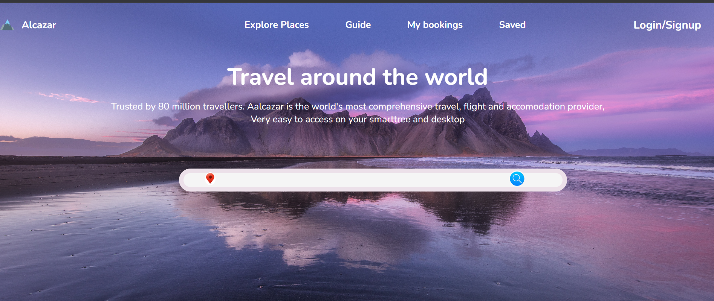
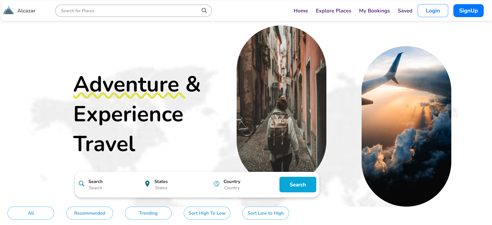
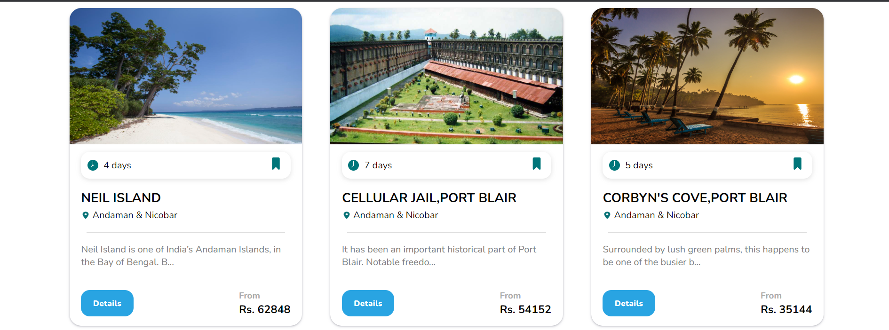
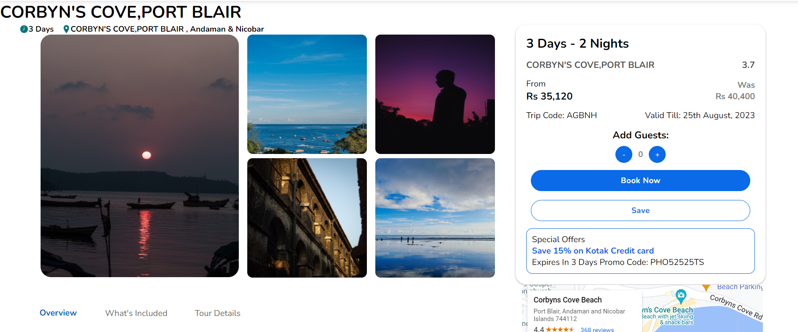
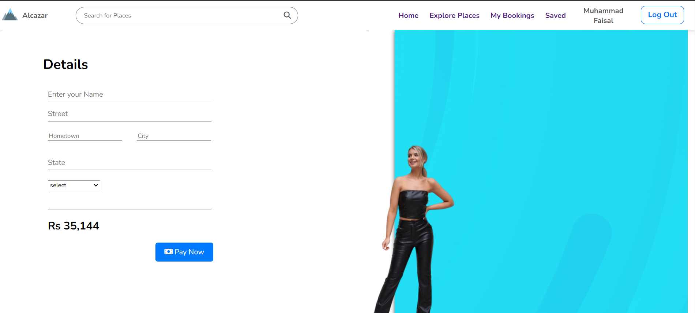
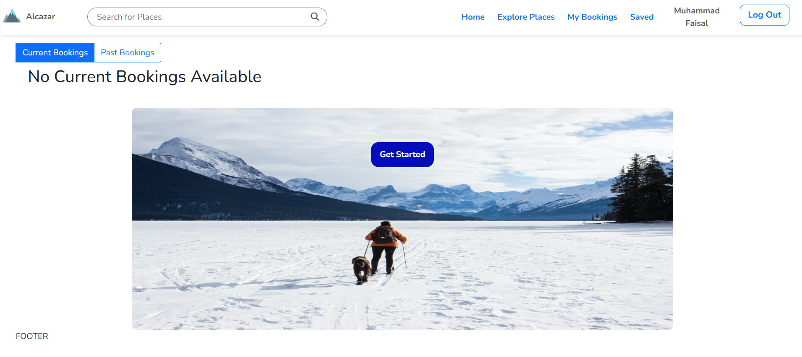
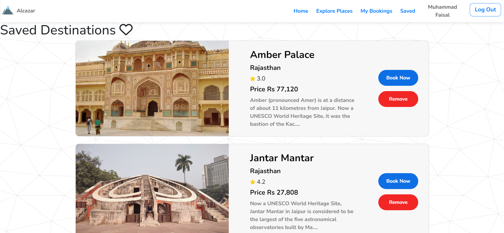

# Alcazar-Travel-Agency
A Dynamic Website built on HTML, CSS and JS that lets you book travel destinations.

##Features
User Specificity and Personalized user experience
Debouncing search feature
Firebase Authentication
Search Functionality througout
Filter functionality In the product page.
Integrated Razorpay payment gateway.

## Solution Approach

### Waterfall Model

- Requirements

- Design

- Implementation

- Verification

- Maintenance

## 🛠 Tech Stack

**Tech stack:** Html
CSS
Javascript
Firebase
APIs

**Server:** Json Server (Npm)

**Apis:**
- unsplash

**Others:** Local Storage, Google Map Embeded link 

## Website flow for **_User_**

- Home page (index.html)

- Destinations List

- Destination Details

- Payment

- My Bookings

-Saved

<h3>Team Members</h3>
<ul>
  <li>Muhammad Faisal</li>
  <li>Nikita Rathee</li>
  <li>Shubham Agdari</li>
  <li>Sneha Raj</li>
</ul>

Login Page

Home Page

Product Page

Product Details Page

payment page

Bookings page

Saved Destinations

## Thank you note

Thank you all who is giving precious time to visit our little creative project which is made with lot of efforts.
